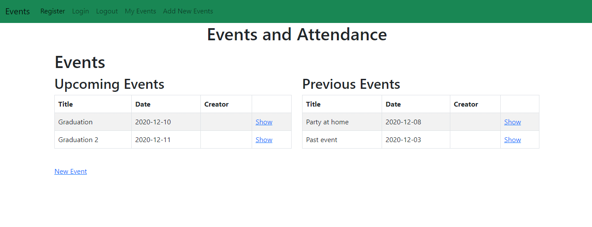

# Private Events

> The project is based on Rails Asociations. If a user is logged in
> will have the ability to create a new events and Invite users to that event, if the user is not logged in
> he won't be able to



Additional description about the project and its features.

## Built With

- Ruby
- Rails
- Bootstrap
- SQLite3

### Prerequisites

- Ruby 2.7.0
- Rails gem
- Bundle

### Setup

- Open your terminal and go to the directory where you want to clone the repo.

- Clone the repository to your local machine.

`git clone https://github.com/elberthcorniell/private-events`

- Go to the private-events directory.

- `cd private-events`

- Install the necessary gems to run the project.

- run `bundle install`

  > Also please run this command to run all the migration for the database and have all tables updated and read to use

- run `rails db:migrate`

  > Now your environment is ready to run the project. Type:

  > run `rails server`

  ### Testing methods

For testing please escute the next steps:

- Execute the following code on the terminal to get the Gems needed:

```
bundle install
```

- Run the test with the following command:

```
rspec ./spec/_spec_user.rb -f d
```
```
rspec ./spec/_spec_event.rb -f d
```
```
rspec ./spec/_spec_attendance.rb -f d
```

## Authors

👤 **Elbert Corniel**

- GitHub: [@elberthcorniell](https://github.com/elberthcorniell)
- Twitter: [@elberthcorniell](https://twitter.com/elberthcorniell)
- LinkedIn: [Elbert Corniell](https://www.linkedin.com/in/elbert-corniell-989183159/)

👤 **Devkc**

- Github: [@cvilla714](https://github.com/cvilla714)
- Twitter: [@kckeyti](https://twitter.com/kckeyti)
- LinkedIn: [Cosmel Villalobos](https://www.linkedin.com/in/cosvilla/)

## 🤝 Contributing

Contributions, issues, and feature requests are welcome!

Feel free to check the [issues page](https://github.com/elberthcorniell/private-events/issues).

## Show your support

Give a ⭐️ if you like this project!

## Acknowledgments

- The Odin Project
- Microverse
- Rails Guides

## 📝 License

This project is [MIT](./LICENSE) licensed.
